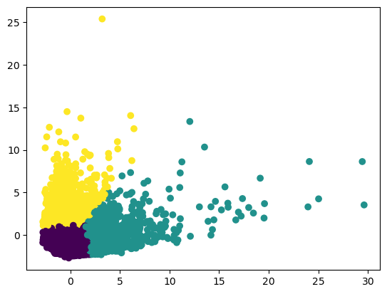
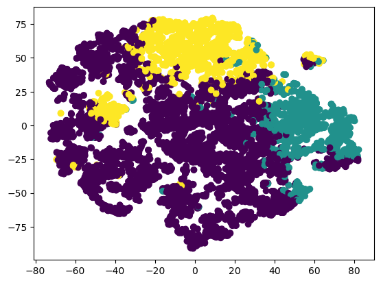
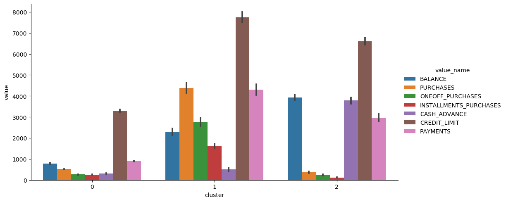

# UnsupervisedML-Market_Segmentation_in_Insurance
#### Project name: Market Segmentation in Insurance
#### Author: Qichun Yu
#### Notebook: https://github.com/JacksonYu92/UnsupervisedML-Market_Segmentation_in_Insurance/blob/main/Market_Segmentation_in_Insurance-Final_Project.ipynb

## Table of Contents
1. [Introduction](#Abstract)  
    1.1. [Abstract](#Abstract)  
    1.2. [Use Case](#Use-Case)  
    1.3. [Load and Read Data](#Load-and-Read-Data)  
    1.4. [Data Cleaning](#Data-Cleaning)
2. [Analysis and Visualization](#Analysis-and-Visualization)
3. [Preprocessing](#Preprocessing)
4. [Models](#Models)  
    4.1. [K-means Clustering](#K-means-Clustering)  
    4.2. [Hierarchical Clustering](#Hierarchical-Clustering)  
    4.3. [Density-Based Spatial Clustering of Applications with Noise (DBSCAN)](#Density-Based-Spatial-Clustering-of-Applications-with-Noise-(DBSCAN))  
5. [Dimensionality Reduction (PCA)](#Dimensionality-Reduction)  
    5.1. [PCA K-means](#PCA-K-means)    
    5.2. [PCA Hierarchical Clustering](#PCA-Hierarchical-Clustering)  
    5.3. [PCA DBSCAN](#PCA-DBSCAN)  
6. [Dimensionality Reduction (TSNE)](#T-Distributed-Stochastic-Neighbor-Embedding-(TSNE))  
    6.1. [TSNE K-means](#TSNE-K-means)    
    6.2. [TSNE Hierarchical Clustering](#TSNE-Hierarchical-Clustering)  
    6.3. [TSNE DBSCAN](#TSNE-DBSCAN)  
7. [Discussion](#Discussion)
8. [Conclusion](#Conclusion)

### Abstract

The project is developing **unsupervised machine-learning models** to group customers into segments for the purpose to give insurance product recommendations. Customers are divided into subgroups based on some types of similar characteristics. The dataset includes summary information on 18 behavioural variables from the 8,950 active credit cardholders. Behaviours include how a customer spends and pays over time. The notebook explores different unsupervised algorithms such as **k-means, hierarchical clustering, and DBSCAN** for an insurance company to divide customers into groups to optimize marketing campaigns for insurance products. Standardization is used to rescale data to have a mean of 0 and a standard deviation of 1.  **PCA and TSNE** methods are used for dimensionality reduction and visualization.  After comparing with the silhouette score and visualized plots, the optimal model is the k-means method with a k value of three that is trained with PCA scaled data. There are small groups of people who have similar behaviours on purchasing, cash advances, credit limits and so on. The K-means clustering method helps identify the group that has similar features. After the segmentation, an insurance company will provide insurance product recommendations based on their characteristics. 

### Use Case
The insurance industry is competitive. Building strong relationships with customers and maintaining customer engagement outside a claim or a renewal is important. An insurance company is developing a machine learning model to classify customers to provide recommendations on insurance products. Customer segmentation is dividing customers into different groups that have similar characteristics, needs, or goals. The insurance company can offer various products such as saving plans, loans, wealth management and so on to different segments. A successful machine learning model can help the company optimize marketing campaigns, identify new opportunities, and increase customer retention rates. 

### Dataset

The sample Dataset summarizes the usage behavior of about 8,950 active credit cardholders during the last 6 months. The file is at a customer level with 18 behavioral features:
<ol>
    <li>CustID</li>
<li>Balance</li>
<li>Balance Frequency</li>
<li>Purchases</li>
<li>One-off Purchases</li>
<li>Installment Purchases</li>
<li>Cash Advance</li>
<li>Purchases Frequency</li>
<li>One-off Purchases Frequency</li>
<li>Purchases Installments Frequency</li>
<li>Cash Advance Frequency</li>
<li>Cash Advance TRX</li>
<li>Purchases TRX</li>
<li>Credit Limit</li>
<li>Payments</li>
<li>Minimum Payments</li>
<li>PRC Full payment</li>
<li>Tenure</li>
</ol>

### Citation

Jillani Soft Tech.(September, 2022). Market Segmentation in Insurance Unsupervised. Retrieved from https://www.kaggle.com/datasets/jillanisofttech/market-segmentation-in-insurance-unsupervised.

Using PCA to visualization pca scaled data with k-means of n_clusters=3.

Using TSNE to visualization pca scaled data with k-means of n_clusters=3:

Let's create a summary table for these three customer group:

|Cluster | Balance | Purchases | Oneoff_purchases | Installments Purchases | Cash Advance | Credit_limit | Payments | Insurance Product Recommendation |
|:-----: | :-: |:-: |:-: |:-: |:-: |:-: |:-: | :-: |
| Cluster 0 | low	| low | low | low | low | low | low | <strong> Saving Plan</strong> |
| Cluster 1 | medium | high| high | high | low | high | high | <strong> Wealth Management </strong> |
| Cluster 2 | high | low | low | low | high | high | high | <strong> Loan </strong> |

**Recommendation:** 

**Cluster 0:** Customers who have low balances, low credit limits, and low purchases. These customers could be low-income and don't likely spend too much on purchasing goods. We should offer a **saving plan** for them.  
**Cluster 1:** Customers who have high credit limits, high purchases, low cash advance, and high payments. These customers could be medium and high-income customers who are able to pay for their credit cards on time. They don't use cash advance too often; therefore, we should offer a **wealth management plan** for this group of customers.  
**Cluster 2:** Customers who have a high balance, low purchase, high cash advance, high credit limit, and high payments. Customers who use cash advance a lot is more likely to need a loan. Therefore, we should  offer a **loan plan** for this group of customers

### Conclusion

The study explored a range of different clustering algorithms such as k-means, hierarchical clustering, and DBSCAN. Standardization is useful for unsupervised models that require distance metrics. Different hyperparameters are evaluated with the silhouette score. The silhouette score is a metric that helps evaluate the performance of unsupervised learning methods. PCA and TSNE are methods used for dimensionality reduction and visualization in the project. After comparing with the silhouette score and visualized plots, '3' is the optimal number of clusters for the dataset. The PCA scaled data that used the k-means method with a k value of three is the optimal choice. 

Based on the above analysis, customers can be divided into three groups. The first group of customers are low-incomers and small spenders; therefore, a saving plan is recommended for this group. The second group of customers are able to pay for credit cards on time and don't like to use cash advance so the company should offer a wealth management plan for this group. The last group of customers who use cash advance a lot are more likely to accept a loan plan from the insurance company. 

[Go to top](#readme)

